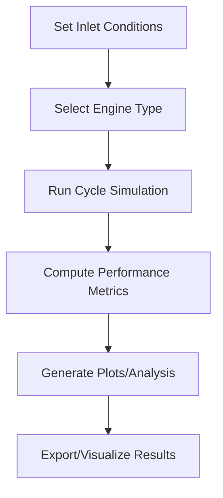

# Jet Engine Cycle Simulator - User Manual

## Project Summary
A modular, object-oriented Python package for simulating and analyzing jet engine thermodynamic cycles, including real gas effects, afterburning, and altitude/Mach performance.

## Workflow Overview
1. **Set Inlet Conditions**
2. **Select Engine Type** (Turbojet, AfterburningTurbojet, etc.)
3. **Run Cycle Simulation**
4. **Compute Performance Metrics**
5. **Generate Plots/Analysis**
6. **Export/Visualize Results**

### Workflow Diagram


## File Structure
- `main.py` - Main entry point for the OOP simulation
- `demo_main.py` - Minimal demo version (no dependencies)
- `core/` - Base engine cycle logic
- `engines/` - Engine types (Turbojet, AfterburningTurbojet, etc.)
- `utils/` - Utilities (atmosphere model, constants)
- `visualization/` - Plotting and analysis tools
- `notebooks/` - Example Jupyter notebooks
- `docs/` - Documentation and API docs
- `tests/` - Test cases for utility functions

## Setup Instructions
```bash
# Clone the repo
 git clone <repo-url>
 cd JetEngineCycleSimulator-main
# Install dependencies
 pip install -r requirements.txt
# (Optional) Install CoolProp for real gas effects
 pip install CoolProp
# (Optional) Set up pre-commit hooks
 pre-commit install
```

## How to Run the Main Project
```bash
python main.py
```

## How to Run the Demo Version (No Dependencies)
```bash
python demo_main.py
```

## How to Run Tests
```bash
pytest
```

## How to Run the Streamlit UI
```bash
streamlit run ui/app.py
```

## How to Run Example Notebooks
Open any notebook in the `notebooks/` folder with JupyterLab or VSCode. 