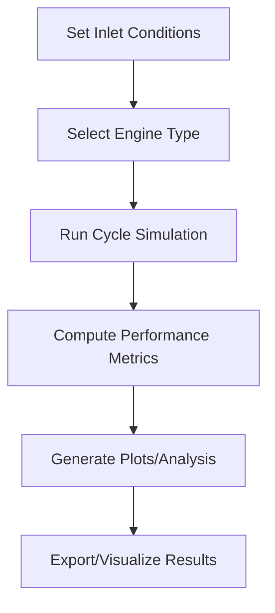

# Jet Engine Cycle Simulator - User Summary

This summary provides a structured, high-level overview of the project, explaining each major code block in the workflow and the available visualizations.

---

## Project Workflow Diagram

---

## Code Block Explanations (Workflow Steps)

### 1. Set Inlet Conditions
- **Where:** `main.py`, `demo_main.py`, engine class constructors
- **What:** Define ambient temperature, pressure, and other initial parameters for the engine cycle.

### 2. Select Engine Type
- **Where:** `main.py`, `engines/` folder, Streamlit UI
- **What:** Choose which engine model to simulate (e.g., Turbojet, AfterburningTurbojet).

### 3. Run Cycle Simulation
- **Where:** `main.py`, `engines/turbojet.py`, `engines/afterburning_turbojet.py`, `core/engine_cycle.py`
- **What:** Execute the thermodynamic cycle using OOP methods, calculating state points and transitions.

### 4. Compute Performance Metrics
- **Where:** `main.py`, engine class methods, `demo_main.py`
- **What:** Calculate thrust, efficiency, work output, and other key metrics.

### 5. Generate Plots/Analysis
- **Where:** `visualization/` folder, Streamlit UI, notebooks
- **What:** Create performance maps, Pareto fronts, and cycle diagrams (T-s, P-v) using matplotlib.

### 6. Export/Visualize Results
- **Where:** Output to terminal, matplotlib windows, Streamlit UI, or Jupyter notebooks
- **What:** Display results for user interpretation and further analysis.

---

## Visualizations Provided
- **Performance Maps:** Contour plots of thrust and efficiency over altitude and Mach number (`visualization/performance_maps.py`).
- **Pareto Fronts:** Trade-off plots comparing thrust vs. efficiency (`visualization/tradeoffs.py`).
- **Cycle Diagrams:** T-s and P-v diagrams for the Brayton cycle (`visualization/diagrams.py`).
- **Streamlit UI:** Interactive web app for parameter selection and real-time visualization (`ui/app.py`).

---

## Quick Project Summary
- **Purpose:** Simulate and analyze jet engine cycles for education, research, and rapid prototyping.
- **Design:** Modular, extensible, and user-friendly Python package with OOP structure.
- **Usage:** Run the demo for a quick start, or use the main simulation, UI, or notebooks for advanced analysis. 