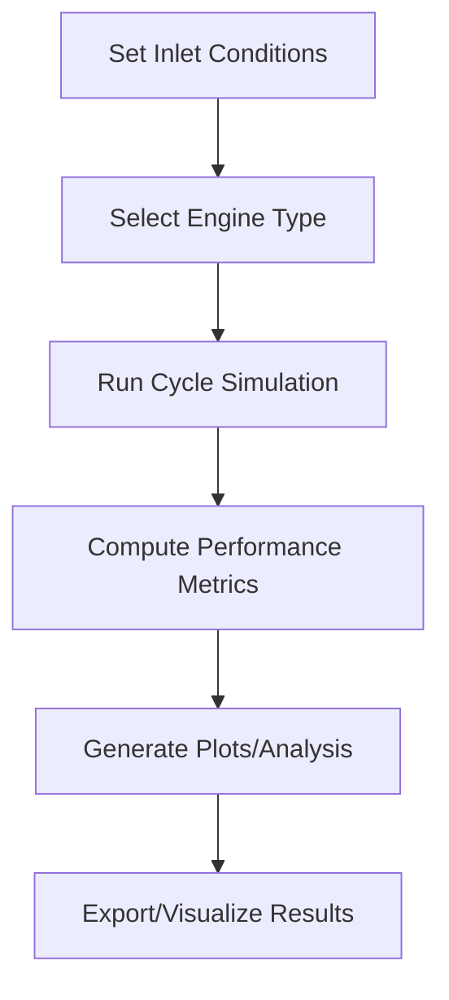

# Code Structure Overview

## Folder Structure
- `core/`: Base engine cycle logic (EngineCycle)
- `engines/`: Engine types (Turbojet, AfterburningTurbojet, etc.)
- `utils/`: Utilities (atmosphere model, constants)
- `visualization/`: Plotting and analysis tools
- `notebooks/`: Example Jupyter notebooks
- `docs/`: Documentation and API docs

## Key Classes & Functions
- `EngineCycle`: Base class for thermodynamic cycles
- `Turbojet`, `AfterburningTurbojet`: Engine models
- `isa_temperature`, `isa_pressure`: ISA atmosphere utilities
- `plot_performance_map`, `plot_pareto_front`, `plot_brayton_cycle_Ts`, `plot_brayton_cycle_Pv`: Visualization functions

## Simulation Workflow
